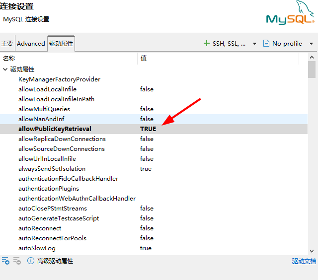

## 常见问题处理
### 1、Public Key Retrieval is not allowed
caching_sha2_password 是MySQL 8的默认认证插件。当连接未加密时，出于安全考虑，服务器需要向客户端发送一个公钥（RSA公钥）来完成密码交换。许多客户端驱动（尤其是Java的JDBC驱动）默认禁止自动获取这个公钥，从而引发了 Public Key Retrieval is not allowed 错误
- 方案一：不使用ssl加密连接，则修改连接字符串（以Java JDBC为例）
```properties
jdbc:mysql://你的服务器地址:3306/数据库名?useSSL=false&allowPublicKeyRetrieval=true
```
    如果使用dbeaver工具连接,则在连接配置中设置"allowPublicKeyRetrieval"选项为True
<div align="center">

</div>

- 方案二：使用SSL/TLS加密连接（推荐用于生产环境）  
在启动容器时，通过 volumes 挂载证书文件，并在MySQL配置文件（my.cnf）中指定路径
```properties
jdbc:mysql://你的服务器地址:3306/数据库名?useSSL=true&serverTimezone=Asia/Shanghai
```
- 方案三：修改用户认证插件
```shell
# 登录mysql
mysql -uroot -p

# 查看 root 用户绑定在哪些主机上
SELECT user, host, plugin FROM mysql.user WHERE user = 'root';

# 修改所有相关的 root 账户
ALTER USER 'root'@'%' IDENTIFIED WITH mysql_native_password BY '你的新密码';
ALTER USER 'root'@'localhost' IDENTIFIED WITH mysql_native_password BY '你的新密码';

# 刷新权限
FLUSH PRIVILEGES;
SELECT user, host, plugin FROM mysql.user WHERE user = 'root';
```


-- 查看binlog占用空间
SHOW BINARY LOGS;

-- 立即清理7天前的binlog（根据需求调整天数）
PURGE BINARY LOGS BEFORE DATE_SUB(NOW(), INTERVAL 7 DAY);

-- 或清理到指定文件
PURGE BINARY LOGS TO 'binlog.000150';

-- 查看binlog保留时间（默认30天，可调整为7天）
SHOW VARIABLES LIKE 'binlog_expire_logs_seconds';
-- 临时设置为7天（604800秒）
SET GLOBAL binlog_expire_logs_seconds = 604800;
